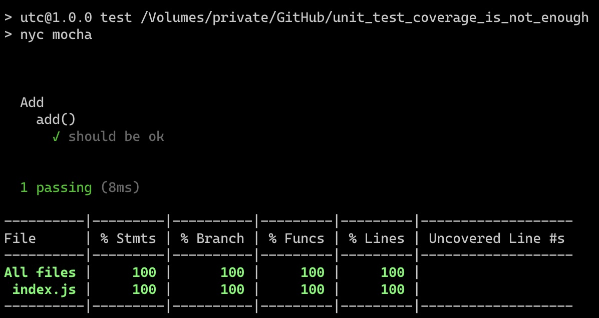

# Unit Test Coverage is not enough

### **Unit Test Coverage tells you which parts of your code are not tested. It does not tell you if they are tested properly.**

- `add` function implementation ([`index.js`](index.js)) is obviously wrong
- unit test ([`test.js`](test/test.js)) has 4 tests for 1 line of code (covering zeros, integers, float and doubles)
- and it passes and gets 100% coverage

See it for yourself:

```
npm install
npm run test
```


